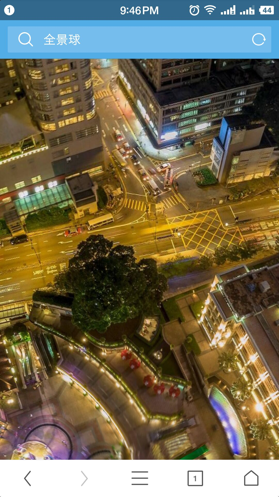
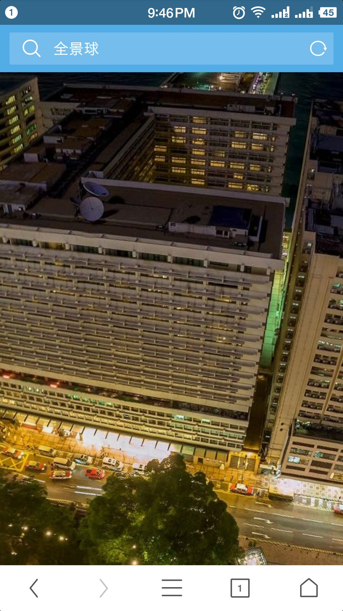
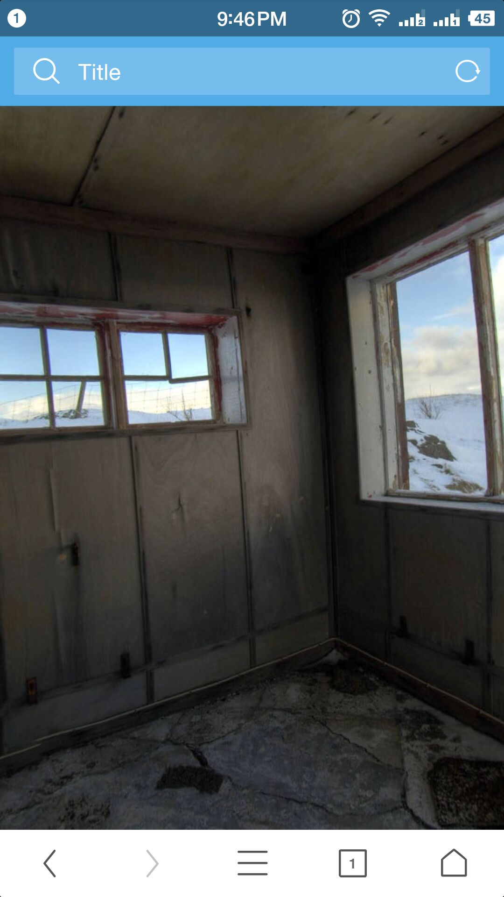
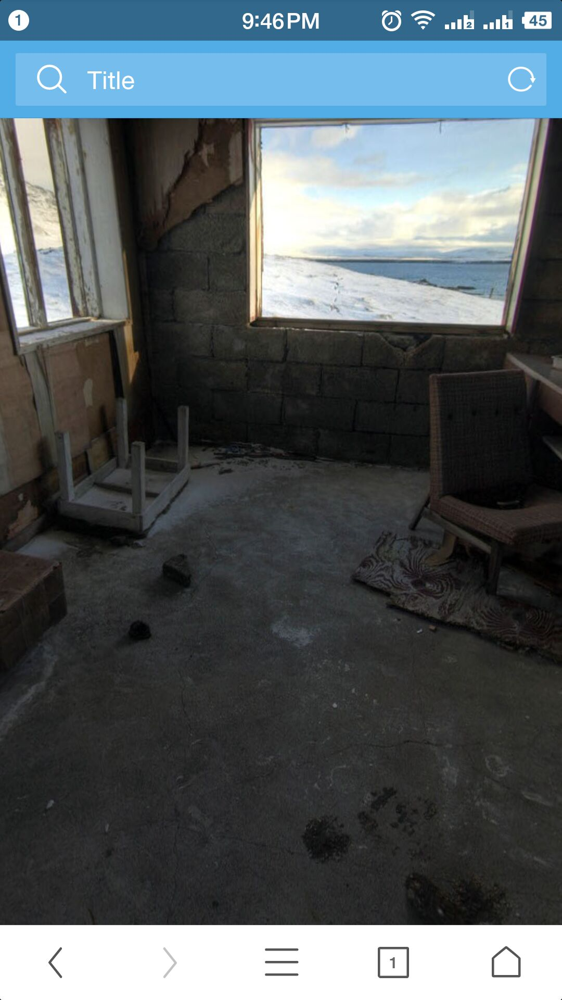
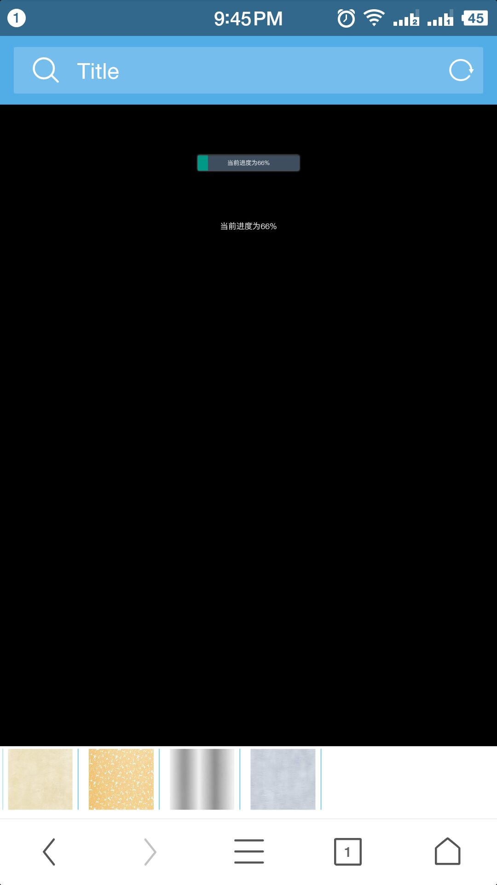

# Three-WebGL
>28
>这是一个球形全景图 

 &nbsp; &nbsp; &nbsp;

>DeviceOrientationControls
>这是一个球形全景图，添加了陀螺仪 

 &nbsp; &nbsp; &nbsp;

>custom-made-master
>这是定制椅子的一个小demo，功能粗糙 

一开始有一个加载模型的进度条 
 
#### 加载完成后显示 
 
#### 点击图片后换皮肤 
 
